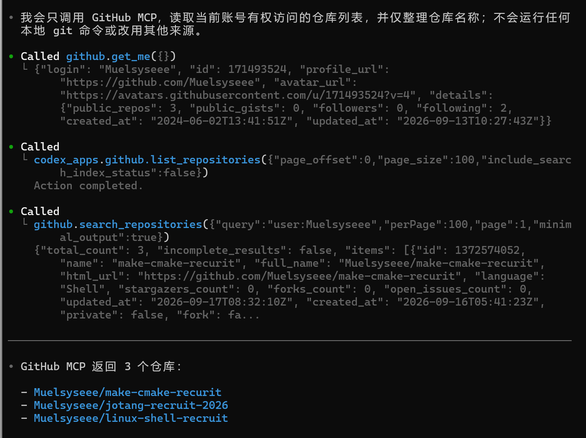

# 题目五 AI Agent
## 任务1
1. codex
2. 之前已经安装过codex桌面端，所以这次在Linux中安装codex cli，具体过程：
- 为新装的Ubuntu安装Node.js/npm
- 通过npm全局安装codex cli，装好后能正常识别
- 登录时选用“Sign in with ChatGPT”（使用桌面端时已准备过plus账户）
- 浏览器授权（遇到Linux用不了windows代理的问题）
- 询问ai后在WSL开启mirrored网络模式，使用代理url，解决问题
- 在仓库中打开codex，配置完成
3. 让agent整理仓库结构，规范文件命名，并根据我的要求辅助撰写`README.md`与`AGENT.md`
4. 整理仓库结构，规范命名，撰写`README.md`与`AGENT.md`
5. 仓库结构的变化与新增md文档内容
6. 符合预期

## 任务2
1. agent由harness和model构成，拥有能够访问外部并执行指令的tools，还有loop进行流程统筹，得到的结果交由model处理并得到下一步指令。而普通ai没有外部操作工具和执行环境
2. 读取、修改文件，执行终端命令，操作浏览器，调用api等
3. agent只知道目标，不知道工作规范，可能执行不当操作，因此需要划分其执行任务的边界，让agent工作更标准和完整
4. agent工作需要上下文以理解整个对话的所有信息，上下文窗口（context window）规范了这个范围的大小。当对话等内容超过这个范围，agent就获取不了窗口外的信息，表现为“忘记”；agent处理文本信息的基本单位是token，对话、工作等行为都会消耗token，额度消耗就是token消耗
5. agent的行为不一定正确，必须要人监督把关。如果给其这样大的权限，可能会错误地删除、修改文件，后果不可挽回，因此重要的指令权限必须掌握在人手中

## 任务3
1. 配置了GitHub MCP Server，让agent直接读取仓库、管理Issue/PR、查看Actions等
- 在GitHub上生成了PAT，用于agent连接时进行身份认证与权限管理，并将其加入环境变量（给予了PAT有限的权限，此次测试仅允许其查看我的招新仓库）
- 执行GitHub官方给Codex的配置命令，使用刚生成的PAT
```
codex mcp add github \
  --url https://api.githubcopilot.com/mcp/ \
  --bearer-token-env-var GITHUB_PAT_TOKEN
```
- 打开codex调用MCP并验证，让其仅使用MCP远程查看仓库信息：
