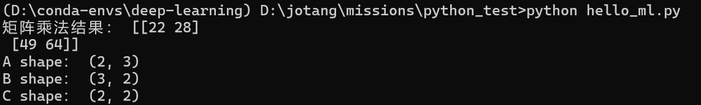
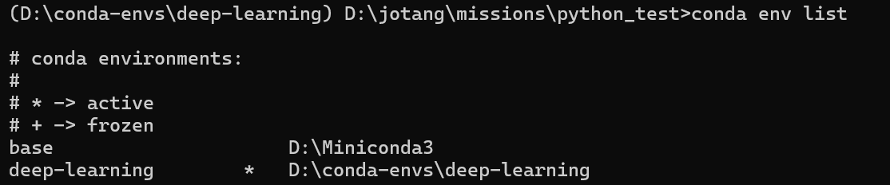
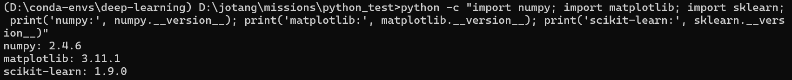
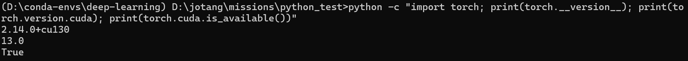
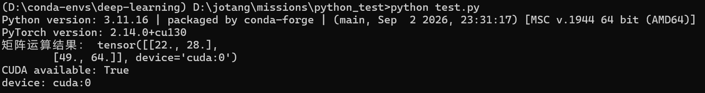

# Task 0 机器学习入门
## Step 1
1. 他们概念范围由大到小。人工智能是最大的概念，指让计算机完成需要人类的智能才能完成的任务，让计算机呈现出“智能”；机器学习则是实现这一目标的方式，它通过让机器已有的“数据”，自动发现其中的信息规律，并用于完成预测等任务；深度学习是机器学习的一种重要方法，通过增加模型神经网络的层次，逐层学习特征，让模型能学习拟合更复杂的规律，以处理更复杂的任务，即让学习过程更“深度”
2. 区别在于数据有无标签：监督学习的数据有标签，模型目标是学习特征的信息以拟合标签，训练过程也需要标签；无监督学习没有标签，模型需要自行寻找数据的规律；两者的典型例子分别是回归和聚类。
3. 数据是收集到的全部信息；标签指每一个样本需要预测的数据，即任务目标；特征指除标签外其他可作为模型输入，用于标签预测的数据;训练集是训练某一个具体模型的数据，用于训练得到模型的参数；验证集用于同一模型或不同模型比较效果，可以测试选择不同的学习率，批量大小等超参数，或比较不同模型结构；测试集用于最终的模型效果测试，测试训练好的模型的实际效果
4. batch size是每次参与训练时进入模型的样本数量；其大小会影响训练时的资源占用与GPU并行运算效率，影响模型的训练时间；还会改变梯度稳定性和一个epoch参数更新次数：批量大小越大，梯度越稳定，在一个epoch内参数更新次数少，反之亦然
5. 模型可以看作从输入到输出的一个映射，进入模型的特征在经过模型处理后得到预测输出；模型参数是影响模型效果的内在因素，他在模型结构确定后在训练中不断调整和学习得到，合适的模型参数搭配上模型才能得到更准确的输出
6. 神经网络是仿照神经结构提出的一种模型结构，由多层相互连接的计算单元组成，输入特征在逐层处理后得到输出，具体包括输入层、隐藏层、输出层，神经元，权重和偏置，激活函数，损失函数这几部分；激活函数是通常放在线性层之后，用于引入非线性的函数，以使得模型能够拟合更深层更复杂的关系。神经网络每一层主体都是线性仿射变换，如果没有层末的激活函数，那多层的网络实际等效一个单层线性变换，层数再多也没用；常见激活函数：ReLU:保留输入中非负部分，其余变成零，该激活函数计算简单，训练效率高，实际操作中非常常用；Sigmoid：将输入压缩到(0,1)，可以表征概率，因此可用于分类模型的输出层，但存在梯度消失问题，隐藏层不常用；Tanh：双曲正切，图像类Sigmoid，但压缩范围是(-1,1)，图像两端部分可能造成梯度消失
7. 矩阵求导本质上仍是对各元素求偏导，并按照输入输出的结构将这些偏导组织起来；根据求导对象不同，形成梯度或雅可比矩阵。在一个网络的反向传播中，通过矩阵求导求得上一层的梯度，并由求导链式法则一层层向前，最后得到损失函数对于所有参数的梯度
8. 假如一个全连接层参数：\(B\)：batch size，\(n_1\)：输入特征维度，\(n_2\)：输出神经元数量，则
\[
X\in\mathbb R^{B\times n_1}
\]\[
W\in\mathbb R^{n_1\times n_2}
\]\[
b\in\mathbb R^{n_2}
\]该全连接层就可以表示为
\[
Z=XW+b
\]\[
A=f(Z)
\]利用矩阵乘法可以一次表示一个 batch 中所有样本与所有神经元之间的线性变换，简化数学表示
9. 前向传播是输入进入模型经模型计算得到输出的过程，反向传播是从输出开始逐层向前计算参数的梯度，用于后续参数更新，由于求导链式法则，已计算的梯度可以继续用于前方层的梯度运算，因此这个过程是反向传播的。
损失函数用于衡量模型预测结果与实际结果的差异程度，量化该差异，并用于参数梯度的计算。模型训练的目标就是通过优化参数使得损失函数尽可能小，即让预测尽可能趋近真实情况。
梯度是损失函数关于参数的偏导数，表示损失增大最快的方向，可以取负表征当前参数对于更优参数的优化方向，在实际参数更新中通过优化器，如
\[
\theta_{t+1}=\theta_t-\eta\nabla_{\theta}L(\theta_t)
\]参与参数更新。
学习率是模型训练时优化参数的超参数，表示参数更新时向梯度更新“步幅”的大小。过小会使收敛缓慢，过大则让收敛不稳定
10. 优化器是训练时参数的优化算法，通过超参数学习率和梯度定向更新参数，减小损失。
常用的有 SGD：
\[
\theta_{t+1}=\theta_t-\eta\nabla_\theta L(\theta_t)
\]即按照当前梯度更新参数；Momentum：在 SGD 基础上加入历史梯度形成的动量，减少震荡并在稳定方向上加速更新；RMSProp：根据近期梯度平方自适应调整不同参数的更新幅度；Adam：结合 Momentum 和 RMSProp 的思想，同时考虑梯度的趋势和尺度，是深度学习中常用的优化器
11. 过拟合指当前参数过于契合训练集，以至于能拟合出训练集可能存在的噪声，缺乏泛化性，在实际运用于验证集和测试集时效果不佳；欠拟合则相反，模型学习能力不足或训练不充分，不能很好地拟合出训练集规律；正则化是避免模型过拟合的方法，常用的有 L1/L2 正则化（为损失函数添加 L1/L2 正则项，防止参数过于极端），丢弃法（训练时每次随机关闭一些神经元输出，减小模型对特定神经元的依赖）等
## Step 2
- 运行命令与结果:

## Step 3
- 安装miniconda，创建一个虚拟环境deep-learning:

- 安装必要包，检查：

- 安装CUDA，GPU版pytorch:

- 运行测试代码，实验张量运算：

### Note:
1. 不同项目可能用到不同版本的python和包，全放在一个环境会导致版本冲突；此外，使用不同虚拟环境管理项目也利于项目复现，可以把某个项目的依赖版本固定并记录下来
2. CPU，核心少，但是单核能力强，适合复杂逻辑、分支判断、串行任务和通用计算；GPU有大量简单计算单元，单个计算能力一般但是数量庞大，适合大规模、重复且可并行的计算。神经网络正好有大量相似的简单并行运算，GPU的并行能力非常契合
3. CUDA是NVIDIA的GPU并行计算平台和编程体系，可以利用GPU进行并行计算。在实际程序中，PyTorch作为深度学习框架，可以通过CUDA将适合并行计算的任务交给GPU执行；显卡驱动则负责操作系统及上层计算软件与实际GPU硬件之间的通信